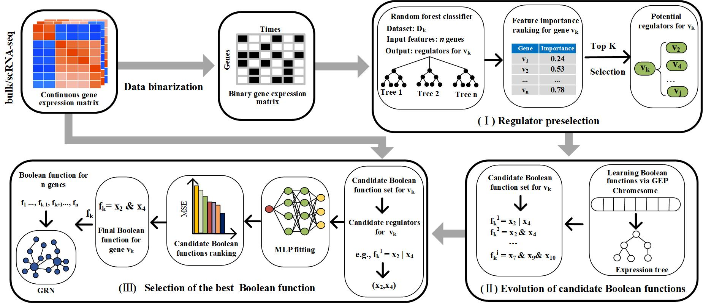

# [LogicGep: Boolean gene regulatory network inference using gene expression programming from times-series transcriptomic profiling data](https://github.com/DZ-Z/LogicGep)

In this work, we proposed a new method for BN inference from time-series transcriptional profiles, called LogicGep,
which reconstructs the network topology and identifies each gene’s Boolean update function with a low time
complexity

## Dependencies

- Python == 3.8 
- scikit-learn==1.0.2
- numpy== 1.21.5
- pandas== 1.4.4
- deap==1.3.3
- geppy== 0.1.3
  
## Usage

